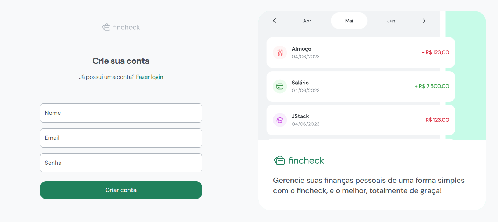

<h1 align="center"> 
  
</h1>

<h3 align="center">
  💰 Fincheck - Controle suas finanças com organização e simplicidade
</h3>

---

## 📖 Sobre o projeto

**Fincheck** é uma aplicação fullstack desenvolvida com **TypeScript**, focada no gerenciamento de finanças pessoais.

Você pode:

- Cadastrar e gerenciar **contas bancárias**
- Adicionar **despesas e receitas**
- Filtrar por **mês**, **conta**, **categoria**
- Acompanhar sua saúde financeira com praticidade

O projeto conta com autenticação completa e interface moderna, responsiva e de fácil navegação.

Este projeto foi desenvolvido com base nos aprendizados do curso [JStack](https://jstack.com.br), e está publicado com frontend e backend online.

---

## 🧪 Tecnologias

[](https://skillicons.dev)

- **React + Vite + Tailwind CSS** no front-end
- **NestJS + Prisma ORM** no back-end
- **PostgreSQL** como banco de dados
- **JWT** para autenticação segura
- Documentação da API com **Swagger**
- Deploy do frontend via **Vercel** e backend via **Render**

---

## 🌐 Acesse o projeto

🔗 [fin-check-theta.vercel.app](https://fin-check-theta.vercel.app/)

---

## 🚀 Rodando o projeto localmente

```bash
# Clone o repositório
git clone https://github.com/luiz-almeida-dev/fincheck
cd fincheck
```

### 🐳 Subindo containers com Docker

```bash
# Inicie o PostgreSQL com Docker
docker-compose up -d
```

> Após subir o container, crie o banco e rode as migrations com o Prisma:

```bash
cd api
npx prisma migrate dev
```

---

### 🧩 Instalando dependências

#### Front-end

```bash
cd frontend
yarn
# ou
npm install
```

#### Back-end

```bash
cd api
yarn
# ou
npm install
```

---

## ⚙️ Variáveis de Ambiente

Crie um arquivo `.env` no diretório `api` com o seguinte:

```env
DATABASE_URL="postgresql://<USER>:<PASSWORD>@<HOST>:<PORT>/<DB_NAME>?schema=public"
JWT_SECRET=suachavesecreta
PORT=3001
```

No front-end (`frontend`), crie:

```env
VITE_API_URL=http://localhost:3001
```

---

### 💻 Executando o projeto

#### Inicie o back-end (NestJS)

```bash
cd api
yarn start:dev
```

#### Inicie o front-end (Vite + React)

```bash
cd frontend
yarn dev
```

---

## 📚 Documentação da API

Acesse a documentação Swagger da API em:

```
http://localhost:3001/api
```

Lá você encontra todos os endpoints, schemas e exemplos de requisição.

---

## 🏗️ Status do Projeto

✅ **Concluído e publicado**  
🛠️ Em constante evolução — novas funcionalidades planejadas!

---

## 🙏 Créditos

Projeto baseado no curso [JStack](https://jstack.com.br) do @MateusSilva.  
Agradecimentos à comunidade que deu suporte e visibilidade na divulgação!

---

## 📝 Licença

Este projeto está sob a licença [MIT](https://rem.mit-license.org).
